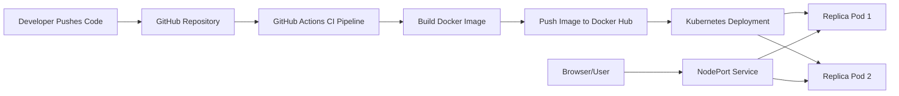
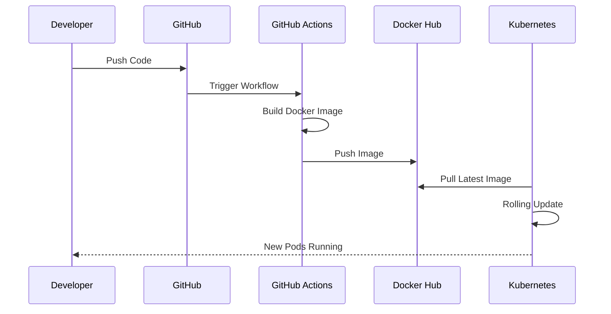

# 🍕 Cloud Pizza – Kubernetes CI/CD Deployment Pipeline


## 📌 Project Overview

Cloud Pizza is a cloud-native Flask application designed to demonstrate a complete DevOps workflow using Docker, Kubernetes, GitHub Actions, and Docker Hub.

The project started as a simple Python Flask application and was transformed into a production-style containerized workload running on Kubernetes with an automated CI/CD pipeline.

This project showcases:

* Application Containerization using Docker
* Kubernetes Deployments and Services
* Automated Docker Image Builds
* Continuous Integration using GitHub Actions
* Docker Hub Registry Integration
* Kubernetes Image Rollouts
* Troubleshooting and Deployment Automation

---

# 🏗 Architecture



---

# 🚀 CI/CD Pipeline



---

# 🛠 Technology Stack

| Category           | Technology     |
| ------------------ | -------------- |
| Backend            | Python Flask   |
| Containerization   | Docker         |
| Orchestration      | Kubernetes     |
| Local Cluster      | Minikube       |
| CI/CD              | GitHub Actions |
| Container Registry | Docker Hub     |
| Version Control    | Git & GitHub   |
| Operating System   | Ubuntu Linux   |

---

# 📂 Project Structure

```text
cloud-pizza/
│
├── app.py
├── Dockerfile
├── requirements.txt
│
├── deployment.yaml
├── service.yaml
│
├── .github/
│   └── workflows/
│       └── deploy.yml
│
├── README.md
└── .gitignore
```

---

# 🐳 Dockerization

The Flask application is containerized using Docker.

### Build

```bash
docker build -t cloud-pizza .
```

### Run

```bash
docker run -p 5000:5000 cloud-pizza
```

---

# ☸ Kubernetes Deployment

The application runs with:

* 2 Replicas
* Rolling Updates
* NodePort Service Exposure
* Automatic Image Pulls

### Deployment

```bash
kubectl apply -f deployment.yaml
```

### Service

```bash
kubectl apply -f service.yaml
```

### Verify

```bash
kubectl get deployments
kubectl get pods
kubectl get svc
```

---

# 🔄 GitHub Actions Workflow

Every push to the `main` branch automatically:

1. Checks out source code
2. Authenticates with Docker Hub
3. Builds a Docker image
4. Pushes image to Docker Hub

Workflow:

```yaml
name: Build and Push Docker Image
```

Result:

```text
Git Push
    ↓
GitHub Actions
    ↓
Docker Build
    ↓
Docker Hub Push
```

---

# 📦 Docker Hub Integration

Docker images are automatically published to:

```text
tejasbargujepatil/cloud-pizza:latest
```

This enables Kubernetes clusters to pull and deploy the latest application version automatically.

---

# 🔍 Challenges Encountered & Solutions

## Challenge 1: Kubernetes Cluster Unavailable

### Error

```text
The connection to the server localhost:8080 was refused
```

### Root Cause

No Kubernetes cluster was running.

### Solution

Installed and started Minikube:

```bash
minikube start --driver=docker
```

---

## Challenge 2: Image Pull Failure

### Error

```text
ErrImageNeverPull
```

### Root Cause

Kubernetes attempted to use a local image that was unavailable inside the Minikube environment.

### Solution

Configured Deployment to use:

```yaml
image: tejasbargujepatil/cloud-pizza:latest
imagePullPolicy: Always
```

---

## Challenge 3: GitHub Actions Docker Tag Failure

### Error

```text
invalid reference format
```

### Root Cause

Docker Hub username secret was not being resolved correctly.

### Solution

Simplified workflow and used explicit image naming:

```bash
docker build -t tejasbargujepatil/cloud-pizza:latest .
docker push tejasbargujepatil/cloud-pizza:latest
```

---

## Challenge 4: Kubernetes Rolling Update Verification

Verified deployment migration from:

```text
cloud-pizza
```

to

```text
tejasbargujepatil/cloud-pizza:latest
```

using:

```bash
kubectl describe pod -l app=pizza | grep Image:
```

---

# 📈 DevOps Concepts Demonstrated

* CI/CD Pipeline Design
* Containerization
* Infrastructure Automation
* Kubernetes Workload Management
* Service Discovery
* Rolling Updates
* Docker Registry Integration
* Source Control Workflows
* Cloud-Native Application Deployment
* Troubleshooting Production-like Deployments

---

# 🎯 Key Achievements

✅ Built a Dockerized Flask Application

✅ Created Kubernetes Deployment with Multiple Replicas

✅ Exposed Application Using Kubernetes Service

✅ Implemented Automated CI Pipeline with GitHub Actions

✅ Published Images to Docker Hub Automatically

✅ Configured Kubernetes to Pull Latest Images

✅ Performed Rolling Updates Without Downtime

✅ Troubleshot Real Deployment Issues

---

# 🔮 Future Improvements

* Deploy to Amazon EKS
* Store Images in Amazon ECR
* Implement GitOps with ArgoCD
* Add Monitoring with Prometheus & Grafana
* Introduce Helm Charts
* Configure Automated CD to Kubernetes
* Add Security Scanning using Trivy
* Implement Blue-Green Deployments

---

# 👨‍💻 Author

**Tejas Barguje Patil**

Cloud | DevOps | AWS | Kubernetes Enthusiast

GitHub:
https://github.com/tejasbargujepatil

Docker Hub:
https://hub.docker.com/u/tejasbargujepatil

---

## ⭐ What This Project Demonstrates

This project demonstrates practical experience with containerization, Kubernetes orchestration, CI/CD automation, Docker image management, deployment troubleshooting, and modern DevOps engineering workflows.

It represents the complete lifecycle of taking an application from source code to a running Kubernetes workload through an automated delivery pipeline.
